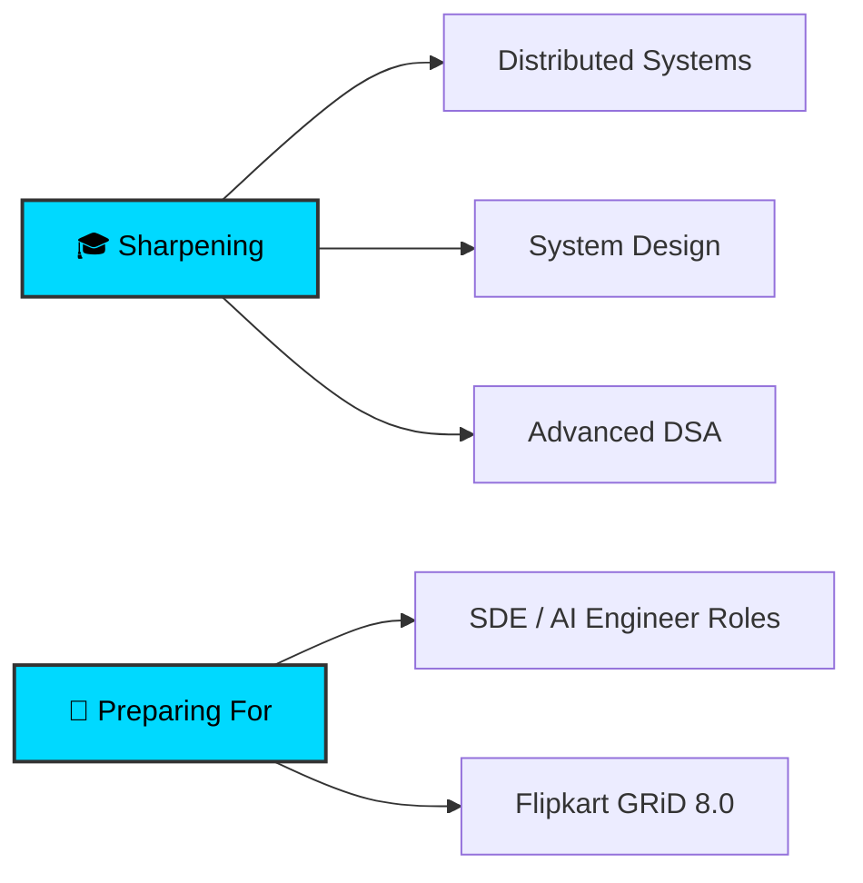

<div align="center">


<p align="center">
  <a href="https://www.linkedin.com/in/divya-ratna-gautam-a925a82a0"></a>
  <a href="mailto:vayugautam249@gmail.com"></a>
  <a href="https://leetcode.com/u/badead249"></a>
  <a href="https://github.com/vayugautam"></a>
</p>


</div>

## 🎯 About Me

```typescript
const divya_ratna = {
    education: "B.Tech in Information Technology — Final Year (HBTU Kanpur)",
    location: "Kanpur, India 🇮🇳",
    focus: ["Backend & Systems", "AI/ML Infrastructure", "Competitive Programming"],
    currentlyLearning: ["Distributed Systems", "System Design", "Cloud & DevOps"],
    lookingFor: "SDE / AI Engineer roles — Full-time & Internships (2026–27)"
};
```

<div align="center">

### 🚀 What I Bring to the Table

</div>

<table align="center">
<tr>
<td width="50%" valign="top">

#### 💡 Engineering Depth
- ⚙️ **Concurrent & systems programming** (multithreading, networking)
- 🤖 **AI/ML infrastructure** — RAG, vector search, model serving
- 🏗️ **Microservices & scalable architecture** (Docker, Kubernetes)
- 🧩 **Custom implementations** over libraries (built from first principles)

</td>
<td width="50%" valign="top">

#### 🎓 Competitive Programming
- 🏆 **LeetCode Knight** — Rating: **2053** (Top 3%)
- 📊 **1,100+ Problems** solved across platforms
- 🥇 **AIR 314** in LeetCode Biweekly Contest 174
- 💪 Strong foundation in **DSA & Algorithms**

</td>
</tr>
</table>


## 🏆 Competitive Programming Achievements

<div align="center">

<table>
<tr>
<td align="center" width="50%">

<br><b>Knight Badge</b><br>
<sub>Top 3% Globally · 1,100+ Solved</sub>
</td>
<td align="center" width="50%">

<br><b>3 Star Coder</b><br>
<sub>Active Competitor</sub>
</td>
</tr>
</table>

### 📈 Contest Performance Highlights

| Platform | Contest | Rank | Field |
|:--------:|:-------:|:----:|:----------:|
| 🟡 **LeetCode** | Biweekly Contest 174 | **314** | 35,000+ |
| 🟤 **CodeChef** | Starters 176 (Div. 3) | **296** | 20,000+ |

</div>


## 💼 Featured Projects

<div align="center">

<table>
<tr>
<td width="50%" valign="top">

### 🛰️ [Deep Packet Inspection Engine](https://github.com/vayugautam/Deep-Packet-Inspection)


**Multithreaded Network Traffic Analyzer**

A from-scratch DPI engine that parses raw network packets in parallel and classifies encrypted traffic in real time.

**🎯 Highlights:**
- 🧵 Producer–consumer pipeline (Load Balancer + Fast Path threads)
- 🔀 Consistent hashing + thread-safe queues, 4+ workers, zero data races
- 🔐 TCP/IP & TLS parsing — extracts SNI from encrypted HTTPS
- 🗺️ Five-tuple flow tracking for per-session state

**🛠️ Tech Stack:**
```
Java · Concurrency · TCP/IP · TLS · PCAP
```

</td>
<td width="50%" valign="top">

### 🧠 [VectorDB — RAG Search Engine](https://github.com/vayugautam/My-AI)


**Custom Vector Database + RAG Pipeline**

A vector database built from scratch — no external DB — powering an end-to-end retrieval-augmented generation pipeline.

**🎯 Highlights:**
- 🔎 HNSW, KD-Tree & brute-force search (cosine / Euclidean / Manhattan)
- 🤖 RAG over Ollama (nomic-embed-text 768-D + llama3.2)
- 📡 Full CRUD REST API with algorithm-benchmarking dashboard
- 📊 Live 2D PCA view of the embedding space

**🛠️ Tech Stack:**
```
Python · HNSW · LLMs · Ollama · REST API
```

</td>
</tr>
<tr>
<td colspan="2" valign="top">

### 🛡️ [SafeCred — AI-Assisted Credit Scoring](https://github.com/vayugautam/SIH-SafeCred) · [Live Demo](https://sih-safe-cred.vercel.app)


**Transparent Credit Scoring for Microfinance — Smart India Hackathon 2025** *(Lead: ML & System Architecture)*

A consent-driven credit-scoring platform for borrowers without formal credit histories, built as containerized microservices.

**🎯 Highlights:**
- 🧩 Microservices — FastAPI ML scoring service + Express API + React frontend
- 🤖 Composite engine: Random Forest / XGBoost model fused with a weighted four-pillar score
- ⚖️ Explainable, consent-gated decisions with per-segment dynamic weighting (< 500 ms)
- 🐳 Docker Compose + Kubernetes, unit-tested scoring logic

**🛠️ Tech Stack:** `Python` `FastAPI` `Scikit-learn` `XGBoost` `Node.js` `PostgreSQL` `Docker` `Kubernetes`

</td>
</tr>
</table>

<sub><b>Other projects:</b> <a href="https://github.com/vayugautam/HackMate-Team-Finder">HackMate</a> (MERN + Socket.io team finder) · <a href="https://github.com/vayugautam/Study-Buddy">LearnMate AI</a> (RAG study assistant) · <a href="https://github.com/vayugautam/FinVault">FinVault</a> (finance platform) · <a href="https://github.com/vayugautam/bitnbuild_frontend">FitSync</a> (fitness tracker)</sub>

</div>


## 🛠️ Technical Arsenal

<div align="center">

### Programming Languages


### Backend & Systems


### AI / ML


### Frontend


### Databases, Cloud & DevOps


### Tools


</div>


## 📊 GitHub Performance Metrics

<div align="center">


</div>


## 🎯 What I'm Currently Working On

<div align="center">



</div>


## 🤝 Let's Connect & Collaborate

<div align="center">

<table>
<tr>
<td align="center" width="25%">
<a href="https://www.linkedin.com/in/divya-ratna-gautam-a925a82a0">

<br><b>Professional Network</b>
</a>
</td>
<td align="center" width="25%">
<a href="mailto:vayugautam249@gmail.com">

<br><b>Direct Contact</b>
</a>
</td>
<td align="center" width="25%">
<a href="https://leetcode.com/u/badead249">

<br><b>Coding Profile</b>
</a>
</td>
<td align="center" width="25%">
<a href="https://github.com/vayugautam">

<br><b>Open Source</b>
</a>
</td>
</tr>
</table>

### 💼 Open to Opportunities


<br><br>

### 📧 Quick Contact

**Email:** vayugautam249@gmail.com  
**Location:** Kanpur, Uttar Pradesh, India  
**Availability:** SDE / AI Engineer — Full-time & Internships (2026–27)

</div>


<div align="center">

<br>

### ⭐ If you find my work interesting, consider giving a star to my repositories!


<sub>Last Updated: June 2026 | Made with ❤️ and ☕</sub>

</div>
