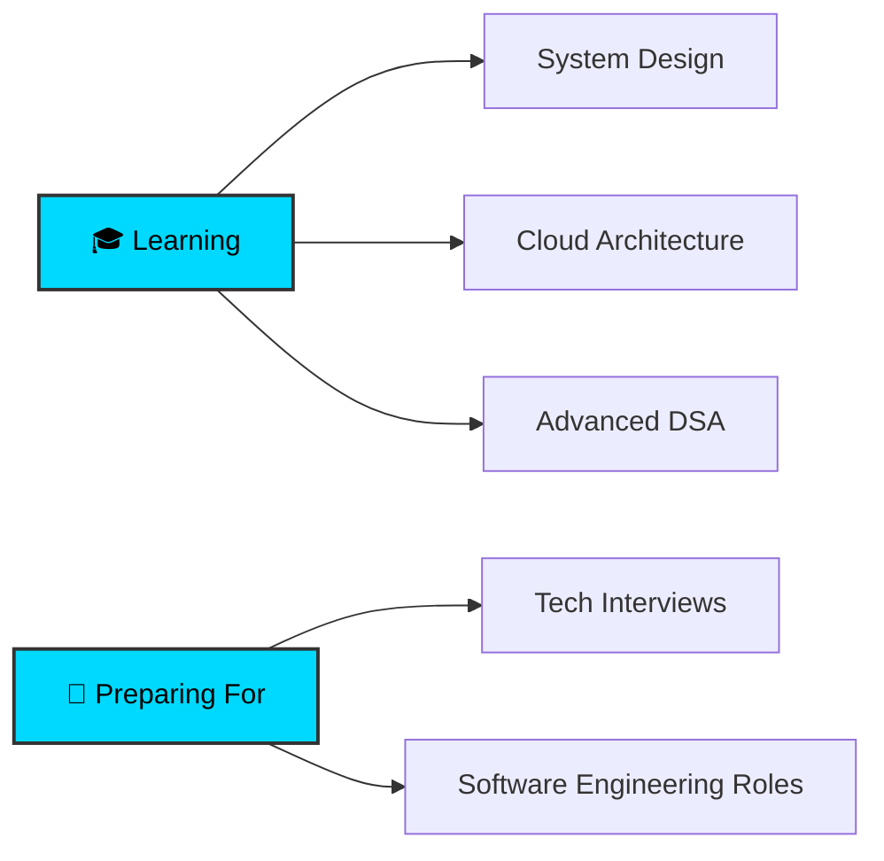

<div align="center">


<p align="center">
  <a href="https://www.linkedin.com/in/divya-ratna-gautam-a925a82a0"></a>
  <a href="mailto:vayugautam249@gmail.com"></a>
  <a href="https://github.com/vayugautam"></a>
</p>


</div>

## 🎯 About Me

```typescript
const divya_ratna = {
    education: "B.Tech Student (Pre-Final Year)",
    location: "Kanpur, India 🇮🇳",
    focus: ["Full Stack Development", "AI/ML", "Competitive Programming"],
    currentlyLearning: ["Advanced Algorithms", "System Design", "Cloud Architecture"],
    lookingFor: "Software Engineering Internship Opportunities"
};
```

<div align="center">

### 🚀 What I Bring to the Table

</div>

<table align="center">
<tr>
<td width="50%" valign="top">

#### 💡 Technical Excellence
- 🏗️ **Full-Stack Development** with modern frameworks
- 🤖 **AI/ML Integration** in real-world applications
- ⚡ **Performance Optimization** & scalable architecture
- 🔐 **Security Best Practices** implementation

</td>
<td width="50%" valign="top">

#### 🎓 Competitive Programming
- 🏆 **LeetCode Knight** - Rating: **1929** (Top 4%)
- 📊 **1000+ Problems** solved across platforms
- 🥇 **Consistent Top Ranker** in weekly contests
- 💪 Strong foundation in **DSA & Algorithms**

</td>
</tr>
</table>


## 🏆 Competitive Programming Achievements

<div align="center">

<table>
<tr>
<td align="center" width="33%">

<br><b>Knight Badge</b><br>
<sub>Top 4% Globally</sub>
</td>
<td align="center" width="33%">

<br><b>3 Star Coder</b><br>
<sub>Active Competitor</sub>
</td>
<td align="center" width="33%">

<br><b>Specialist</b><br>
<sub>Rising Rank</sub>
</td>
</tr>
</table>

### 📈 Contest Performance Highlights

| Platform | Contest | Rank | Percentile |
|:--------:|:-------:|:----:|:----------:|
| 🟡 **LeetCode** | Weekly Contest #437 | **562** | Top 5% |
| 🟤 **CodeChef** | Starters 176 | **296** | Top 2% |
| 🔵 **Codeforces** | Round 1007 (Div. 2) | **3107** | Top 25% |

</div>


## 💼 Featured Projects

<div align="center">

<table>
<tr>
<td width="50%" valign="top">

### 💸 [FinVault](https://github.com/vayugautam/FinVault)


**Intelligent Payment & Finance Platform**

An AI-driven financial management system that revolutionizes money transfers, loan tracking, and financial decision-making.

**🎯 Key Features:**
- ✨ Real-time payment processing
- 🤖 AI-powered financial insights
- 🔒 Bank-grade security
- 📊 Interactive dashboards

**🛠️ Tech Stack:**
```
Frontend: React.js + Tailwind CSS
Backend:  Node.js + Express.js
Database: PostgreSQL
```

</td>
<td width="50%" valign="top">

### 🏋️ [FitSync](https://github.com/vayugautam/bitnbuild_frontend)


**Comprehensive Health & Fitness Platform**

A complete fitness tracking solution with AI-powered nutrition planning and progress monitoring.

**🎯 Key Features:**
- 📱 Activity & workout tracking
- 🥗 Calorie & nutrition monitoring
- 📈 Visual progress analytics
- 🎯 Goal setting & achievements

**🛠️ Tech Stack:**
```
Frontend: React.js + Chart.js
Backend:  Node.js + Express.js
Database: MongoDB
```

</td>
</tr>
<tr>
<td colspan="2" valign="top">

### 🛡️ [SafeCred](https://github.com/vayugautam/SIH-SafeCred)


**AI-Powered Secure Loan Verification System**

An intelligent system ensuring transparency and fraud detection in loan processing with advanced ML algorithms.

**🎯 Key Features:**
- 🔍 Automated document verification | 🎯 ML-based risk assessment | 🚨 Real-time fraud detection | 📊 Comprehensive analytics dashboard

**🛠️ Tech Stack:** `Python` `Flask` `PostgreSQL` `Scikit-learn` `TensorFlow` `AI/ML APIs`

</td>
</tr>
</table>

</div>


## 🛠️ Technical Arsenal

<div align="center">

### Programming Languages


### Frontend Development


### Backend Development


### Database & Cloud


### Tools & Technologies


</div>


## 📊 GitHub Performance Metrics

<div align="center">


</div>


## 🎯 What I'm Currently Working On

<div align="center">



</div>


## 🤝 Let's Connect & Collaborate

<div align="center">

<table>
<tr>
<td align="center" width="25%">
<a href="https://www.linkedin.com/in/divya-ratna-gautam-a925a82a0">

<br><b>Professional Network</b>
</a>
</td>
<td align="center" width="25%">
<a href="mailto:vayugautam249@gmail.com">

<br><b>Direct Contact</b>
</a>
</td>
<td align="center" width="25%">
<a href="https://leetcode.com/badead249/">

<br><b>Coding Profile</b>
</a>
</td>
<td align="center" width="25%">
<a href="https://github.com/vayugautam">

<br><b>Open Source</b>
</a>
</td>
</tr>
</table>

### 💼 Open to Opportunities


<br><br>

### 📧 Quick Contact

**Email:** vayugautam249@gmail.com  
**Location:** Kanpur, Uttar Pradesh, India  
**Availability:** Immediate for internships starting Summer 2025

</div>


<div align="center">

<br>

### ⭐ If you find my work interesting, consider giving a star to my repositories!


<sub>Last Updated: December 2024 | Made with ❤️ and ☕</sub>

</div>
